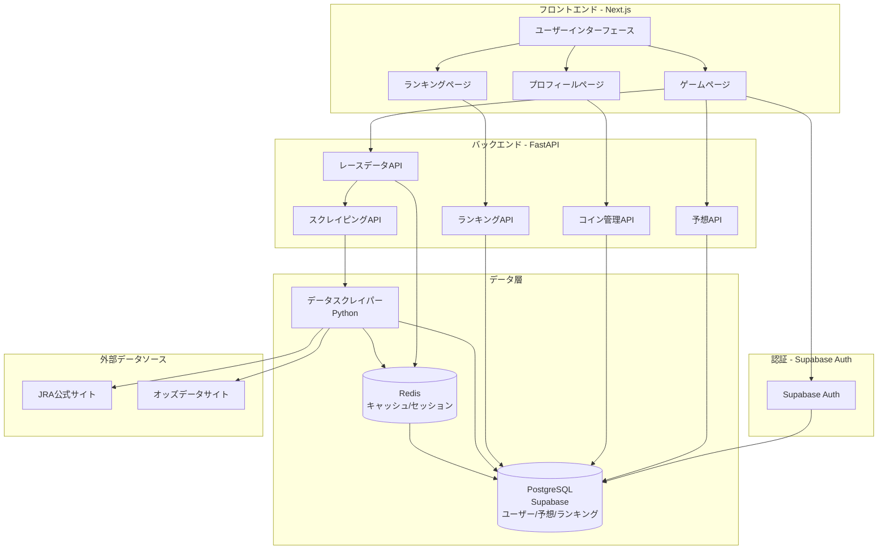
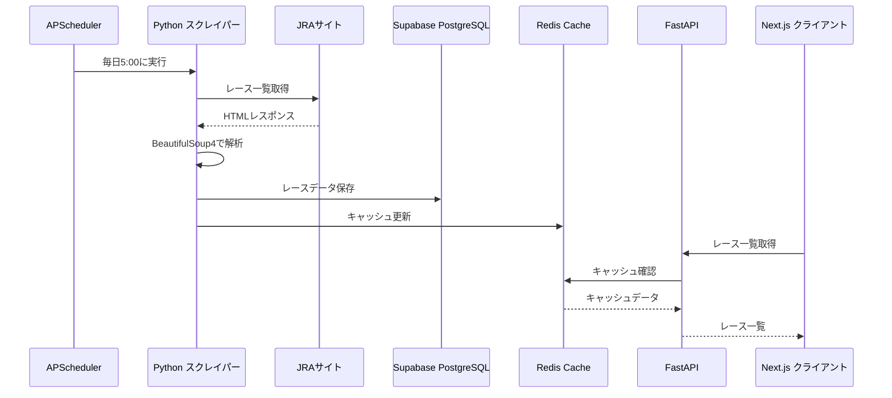
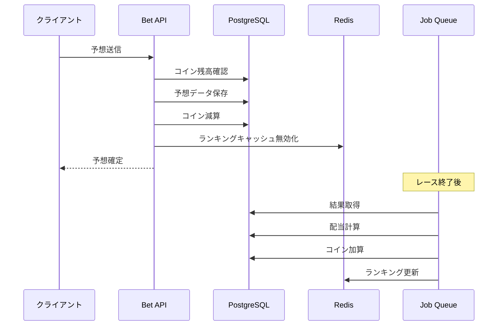
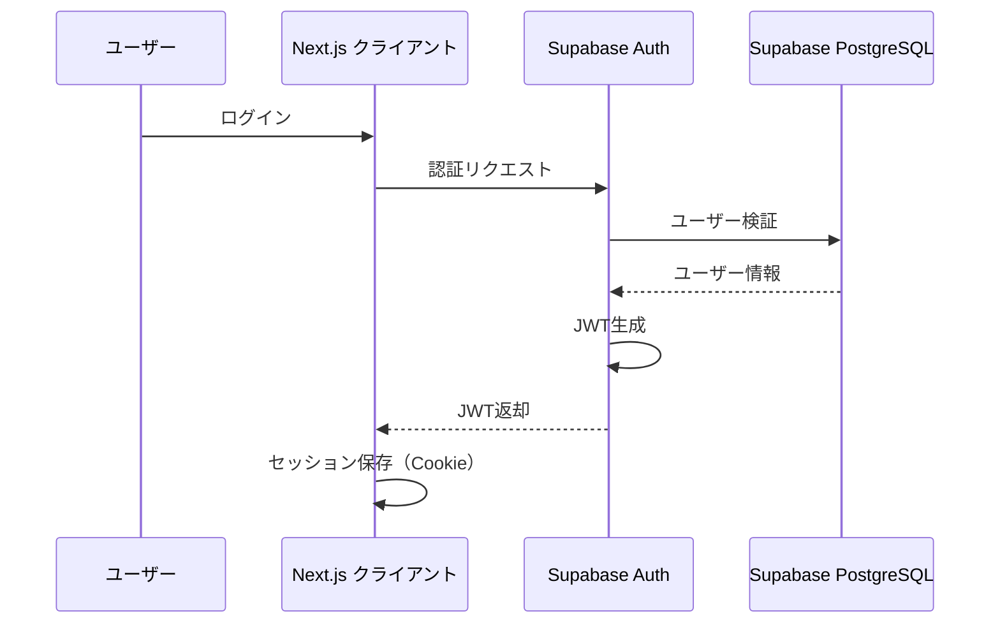

# システムアーキテクチャ

## 全体構成図

## 技術スタック詳細

### フロントエンド

#### Next.js (最新版, App Router)
- **理由**: SSR/SSG対応、SEO最適化、優れたパフォーマンス
- **主要機能**:
  - App Routerによる新しいルーティングシステム
  - Server Componentsによるパフォーマンス最適化
  - 自動コード分割
  - 最新の機能とパフォーマンス改善

#### React 18
- **理由**: 最新のReact機能（Suspense、Concurrent Features）
- **主要機能**:
  - Server Components
  - Streaming SSR

#### TypeScript
- **理由**: 型安全性、開発効率向上、バグ削減
- **設定**: 厳格モード有効

#### Tailwind CSS
- **理由**: 高速なスタイリング、保守性向上
- **設定**: JITモード有効

#### shadcn/ui
- **理由**: 高品質なUIコンポーネント、カスタマイズ容易
- **主要コンポーネント**: Button, Card, Dialog, Table, Badge

#### Zustand
- **理由**: 軽量、シンプルな状態管理
- **用途**: ユーザー情報、コイン残高、認証状態

#### React Query
- **理由**: サーバー状態管理、キャッシング、自動リフェッチ
- **用途**: レースデータ、ランキング、予想履歴

### バックエンド

#### FastAPI (Python)
- **理由**: 高速、非同期処理、自動APIドキュメント生成、Pythonの豊富なライブラリ
- **構成**:
  - `/api/races/*` - レースデータ
  - `/api/scrape/*` - スクレイピング
  - `/api/bets/*` - 予想関連
  - `/api/coins/*` - コイン管理
  - `/api/ranking/*` - ランキング
- **特徴**:
  - 自動OpenAPI/Swaggerドキュメント
  - 非同期処理対応
  - 型ヒントによる型安全性

#### Supabase Auth
- **理由**: 認証機能の完全マネージド、セキュリティが高い、実装が容易
- **機能**:
  - メール認証
  - ソーシャルログイン（Google, Twitter等）
  - セッション管理
  - ユーザー管理
- **統合**:
  - Next.jsクライアントから直接利用
  - JWTトークンによる認証

#### Prisma
- **理由**: 型安全なORM、マイグレーション管理
- **機能**:
  - スキーマ定義
  - マイグレーション
  - クライアント生成（TypeScript）
- **注意**: FastAPIからはPrisma Client (Python) または直接SQLを使用

#### PostgreSQL (Supabase)
- **理由**: リレーショナルデータ、ACID準拠、高パフォーマンス、Supabase統合
- **用途**:
  - ユーザーデータ
  - レースデータ
  - 予想データ
  - ランキングデータ
- **Supabase機能**:
  - 自動バックアップ
  - リアルタイム機能
  - Row Level Security (RLS)

#### Redis
- **理由**: 高速キャッシュ、セッション管理
- **用途**:
  - レースデータキャッシュ
  - オッズデータキャッシュ
  - ランキングキャッシュ

#### Celery (Python)
- **理由**: Python用の信頼性の高いジョブキュー
- **用途**:
  - レースデータ取得ジョブ
  - オッズ更新ジョブ
  - 結果取得ジョブ
  - ランキング更新ジョブ
- **構成**:
  - Redis/RabbitMQをブローカーとして使用
  - ワーカーによる非同期処理

### データ取得

#### Playwright (Python)
- **理由**: ヘッドレスブラウザによるスクレイピング、Python版が安定
- **用途**:
  - JRA公式サイトからのレースデータ取得
  - オッズデータ取得
- **特徴**:
  - 複数ブラウザ対応（Chromium, Firefox, WebKit）
  - 非同期処理対応

#### BeautifulSoup4
- **理由**: Python用のHTMLパーサー、使いやすい
- **用途**:
  - HTMLの解析
  - データ抽出

#### APScheduler
- **理由**: Python用の高度なスケジューラー
- **用途**:
  - 毎日のレースデータ取得
  - 定期的なオッズ更新
- **特徴**:
  - Cron形式のスケジュール
  - 永続化対応

### インフラ

#### Vercel
- **理由**: Next.jsに最適化、自動デプロイ、CDN
- **機能**:
  - 自動デプロイ
  - プレビューデプロイ
  - エッジ関数

#### Upstash
- **理由**: サーバーレスRedis、スケーラブル
- **機能**:
  - 自動スケーリング
  - グローバルレプリケーション

#### Supabase
- **理由**: PostgreSQL + Auth + リアルタイム機能の統合プラットフォーム
- **機能**:
  - PostgreSQLデータベース
  - Supabase Auth（認証）
  - 自動バックアップ
  - 接続プーリング
  - リアルタイム機能
  - Row Level Security (RLS)

#### Railway / Render
- **理由**: FastAPIアプリケーションのホスティング
- **機能**:
  - 自動デプロイ
  - スケーリング
  - 環境変数管理

## データフロー

### レースデータ取得フロー

### 予想フロー

## セキュリティアーキテクチャ

### 認証フロー

### 認可フロー

- **JWT**: Supabase Authが発行するJWTトークン
- **セッション管理**: Supabase Authが管理
- **API保護**: FastAPIミドルウェアによる認証チェック（Supabase JWT検証）
- **レート制限**: 各エンドポイントに設定

## スケーラビリティ設計

### 水平スケーリング

- **フロントエンド**: Vercelによる自動スケーリング
- **API**: Vercel Edge Functions
- **データベース**: 読み取り専用レプリカ
- **キャッシュ**: Redisクラスター

### パフォーマンス最適化

- **CDN**: Vercel Edge Network
- **キャッシング**:
  - レースデータ: 5分間
  - ランキング: 1分間
  - 静的アセット: 1年間
- **コード分割**: 動的インポート
- **画像最適化**: Next.js Image Component

## モニタリング・ロギング

### 監視項目

- **パフォーマンス**:
  - API応答時間
  - ページロード時間
  - データベースクエリ時間
- **エラー**:
  - エラーレート
  - エラーログ
- **ビジネス指標**:
  - DAU/MAU
  - 予想数
  - 課金率

### ロギング

- **構造化ログ**: JSON形式
- **ログレベル**: ERROR, WARN, INFO, DEBUG
- **ログ集約**: 外部サービス（例: Logtail, Datadog）

